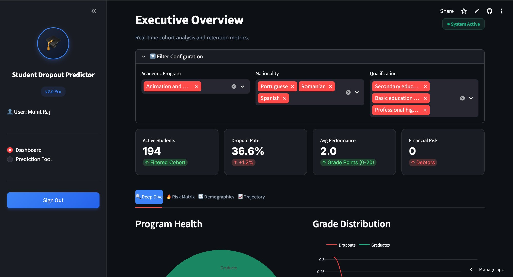
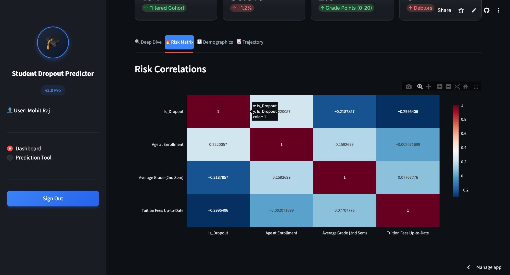
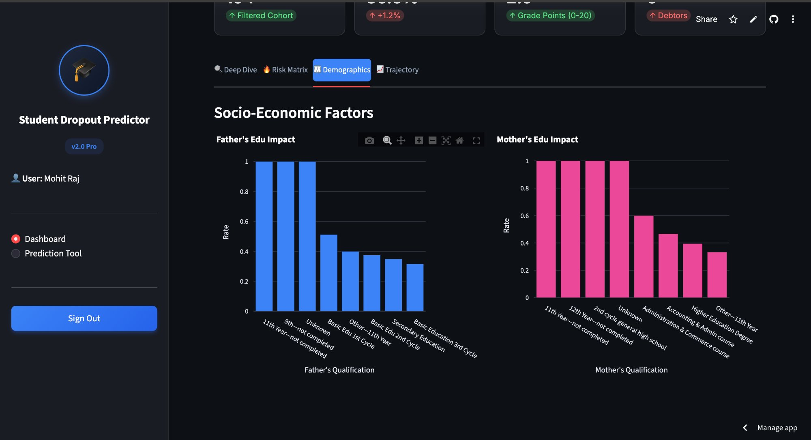
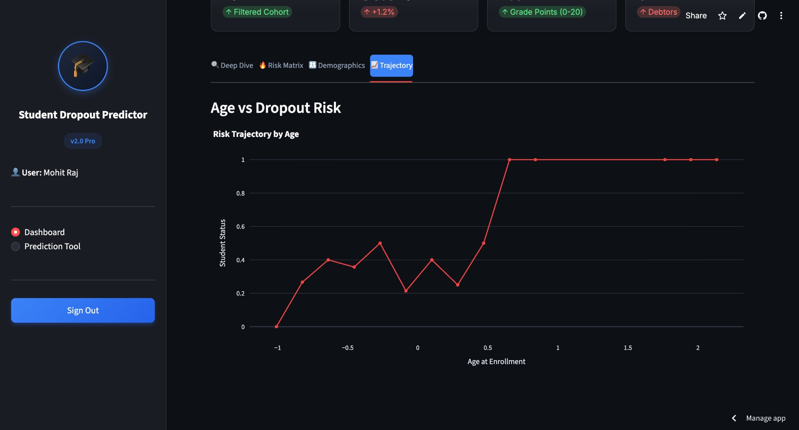
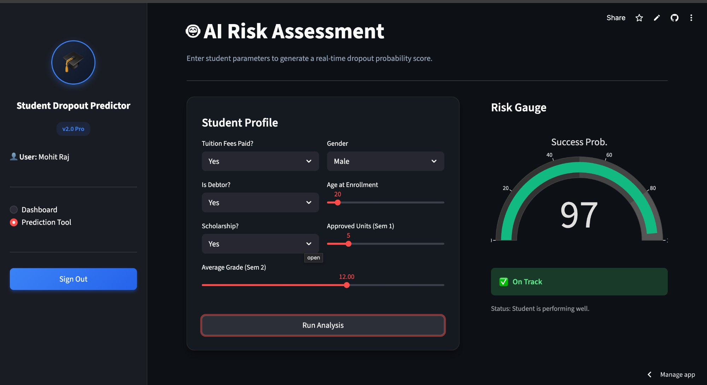

<div align="center">

# 🎓 Student Dropout Predictor — v2.0 Pro

### Next-Gen Machine Learning Dashboard for Student Retention Analytics

[](https://python.org)
[](https://streamlit.io)
[](https://scikit-learn.org)
[](https://plotly.com)
[](https://pandas.pydata.org)

<br/>

> **An AI-powered web application** that predicts student dropout risk using machine learning, with an interactive analytics dashboard built on Streamlit — helping educational institutions identify at-risk students early and take timely action.

<br/>

  

</div>

---

## 📋 Table of Contents

- [✨ Features](#-features)
- [🛠️ Tech Stack](#️-tech-stack)
- [📂 Project Structure](#-project-structure)
- [📊 Dataset Overview](#-dataset-overview)
- [🚀 Getting Started](#-getting-started)
- [🖥️ Application Walkthrough](#️-application-walkthrough)
- [🤖 ML Model](#-ml-model)
- [🎨 UI Design](#-ui-design)
- [🤝 Contributing](#-contributing)

---

## ✨ Features

| Feature | Description |
|---|---|
| 🔐 **Secure Auth** | Login & registration system with SHA-256 password hashing via SQLite |
| 📊 **Executive Dashboard** | Real-time KPI cards — dropout rate, avg performance, financial risk |
| 🔍 **Deep Dive Analytics** | Sunburst chart for program health & grade distribution overlays |
| 🔥 **Risk Correlation Matrix** | Heatmap showing relationships between key dropout factors |
| 👨‍👩‍👧 **Socio-Economic Analysis** | Parental education impact analysis on dropout rates |
| 📈 **Age Trajectory** | Dropout risk trend line across student enrollment ages |
| 🤖 **AI Prediction Tool** | Real-time dropout probability gauge using trained ML model |
| 🌙 **Dark Mode UI** | Full glassmorphism dark theme with smooth hover animations |
| 🔽 **Dynamic Filters** | Filter by Academic Program, Nationality, and Prior Qualification |

---

## 📸 Screenshots

### 🖥️ Executive Dashboard — Deep Dive Tab
> Real-time KPI cards, program health sunburst chart, and grade distribution overlay.



---

### 🔥 Risk Matrix — Correlation Heatmap
> Shows how dropout correlates with age, grades, and tuition payment status.

| Correlation | Variable | Insight |
|---|---|---|
| **+0.22** | Age at Enrollment | Older students = higher risk |
| **-0.22** | Average Grade (2nd Sem) | Better grades = lower dropout |
| **-0.30** | Tuition Fees Up-to-Date | Unpaid fees = strong dropout signal |



---

### 👨‍👩‍👧 Demographics — Socio-Economic Factors
> Parental education level vs dropout rate — students from less-educated family backgrounds face the highest risk.



---

### 📈 Trajectory — Age vs Dropout Risk
> Dropout risk rises sharply for older enrollees (standardised age scale).



---

### 🤖 AI Prediction Tool — Real-Time Risk Gauge
> Enter student parameters → Instant dropout probability score with color-coded alert.



---

## 🛠️ Tech Stack

### Core Framework
| Technology | Purpose |
|---|---|
| **Python 3.8+** | Backend language |
| **Streamlit** | Web app framework & UI rendering |

### Machine Learning
| Technology | Purpose |
|---|---|
| **Scikit-learn** | ML model training & prediction (`student_dropout_model.pkl`) |
| **Statsmodels** | Statistical analysis support |

### Data & Visualization
| Technology | Purpose |
|---|---|
| **Pandas** | Data loading, filtering, and transformation |
| **Plotly Express** | Sunburst charts, bar charts, line charts |
| **Plotly Graph Objects** | Custom gauge/indicator charts |
| **Plotly Figure Factory** | Distribution plots (KDE overlays) |

### Storage & Auth
| Technology | Purpose |
|---|---|
| **SQLite3** | User authentication database (`users.db`) |
| **Pickle** | ML model serialization/deserialization |
| **Hashlib (SHA-256)** | Secure password hashing |

---

## 📂 Project Structure

```
student-dropout-predictor-main/
│
├── app.py                          # 🚀 Main Streamlit application
├── student_dropout_model.pkl       # 🤖 Pre-trained ML model (serialized)
├── processed_student_data.csv      # 📊 Cleaned & feature-engineered dataset
└── requirements.txt                # 📦 Python dependencies
```

---

## 📊 Dataset Overview

The dataset (`processed_student_data.csv`) contains **student academic & socio-economic records** with the following feature categories:

### 🎯 Target Variable
- `Student Status` — **Dropout**, **Graduate**, or **Enrolled**

### 📚 Academic Features
- Credited, Enrolled, Evaluated & Approved Units (Sem 1 & 2)
- Average Grades (Sem 1 & 2)
- Grade Improvement Score
- Approval Rate (1st & 2nd Sem)

### 👤 Personal & Demographic Features
- Age at Enrollment, Gender, Nationality
- Marital Status, International Student flag
- Displaced Student, Special Educational Needs

### 💰 Financial Features
- Tuition Fees Up-to-Date
- Is Debtor
- Scholarship Holder

### 👨‍👩‍👦 Socio-Economic Features
- Mother's & Father's Qualification and Occupation
- Unemployment Rate (%), Inflation Rate (%), GDP per Capita (USD)

### 🎓 Enrollment Features
- Application Mode & Order
- Course Name, Daytime/Evening Attendance
- Previous Qualification

---

## 🚀 Getting Started

### Prerequisites
- Python 3.8 or higher
- pip package manager

### Installation

**1. Clone the repository**
```bash
git clone https://github.com/your-username/student-dropout-predictor.git
cd student-dropout-predictor
```

**2. Install dependencies**
```bash
pip install -r requirements.txt
```

**3. Run the application**
```bash
streamlit run app.py
```

**4. Open in your browser**
```
http://localhost:8501
```

### Default Credentials
> Create a new account on the signup tab, or use any credentials you register on first launch.

---

## 🖥️ Application Walkthrough

### 🔐 Login Page
Secure authentication portal with animated gradient title and tab-based Login / Register UI.

```
Username → Password → Launch Dashboard
```

### 📊 Dashboard — Executive Overview

Once logged in, the dashboard offers **4 analytical tabs**:

#### 🔍 Deep Dive
- **Program Health** — Sunburst chart breaking down enrollment vs dropout vs graduate by course
- **Grade Distribution** — KDE density plots comparing graduate and dropout grade distributions

#### 🔥 Risk Matrix
- Correlation heatmap between `Is_Dropout`, `Age`, `Average Grade`, and `Tuition Status`

#### 👨‍👩‍👧 Demographics
- Bar charts of dropout rates grouped by **Father's** and **Mother's** educational qualification

#### 📈 Trajectory
- Line graph mapping **Dropout Risk (%)** across student **Age at Enrollment**

---

### 🤖 Prediction Tool — AI Risk Assessment

Input a student profile and get a live dropout probability score:

| Input Field | Type |
|---|---|
| Tuition Fees Paid? | Dropdown (Yes/No) |
| Is Debtor? | Dropdown (Yes/No) |
| Scholarship? | Dropdown (Yes/No) |
| Gender | Dropdown (Male/Female) |
| Age at Enrollment | Slider (17–60) |
| Approved Units (Sem 1) | Slider (0–30) |
| Average Grade (Sem 2) | Slider (0.0–20.0) |

**Output:** A real-time **Gauge Chart** displaying the probability score with a color-coded alert:
- 🔴 `High Risk Alert` → Schedule counseling immediately
- 🟢 `On Track` → Student is performing well

---

---

## 🤖 ML Model & Pipeline

### Data Preprocessing
- **Missing values** — Median imputation for numerical columns, mode imputation for categorical
- **Outlier treatment** — IQR capping method (clips at Q1 - 1.5×IQR and Q3 + 1.5×IQR) — preserves data without dropping rows
- **Filtering** — "Currently Enrolled" students excluded from training (incomplete outcomes add noise)

### Feature Engineering (New Columns Created)
| Feature | Formula | Purpose |
|---|---|---|
| `Grade_Improvement` | Grade Sem2 − Grade Sem1 | Captures academic trajectory |
| `Total_Approved_Units` | Approved Sem1 + Approved Sem2 | Overall academic throughput |
| `Approval_Rate_1st_Sem` | Approved / Enrolled | Efficiency in Sem 1 |
| `Approval_Rate_2nd_Sem` | Approved / Enrolled | Efficiency in Sem 2 |

### Model: Random Forest Classifier
- **Algorithm:** `RandomForestClassifier` (Scikit-learn)
- **Tuning:** `GridSearchCV` with params — `n_estimators: [50, 100]`, `max_depth: [10, 20, None]`
- **Train/Test Split:** 80% / 20% with `random_state=42`
- **Target:** Binary — `Dropout = 1`, `Graduate = 0`
- **Serialization:** Saved as `student_dropout_model.pkl` via Pickle

### Top 7 Predictive Features
```
1. Tuition Fees Up-to-Date    (financial)
2. Average Grade (2nd Sem)    (academic)
3. Approved Units (1st Sem)   (academic)
4. Is Debtor                  (financial)
5. Scholarship Holder         (financial)
6. Age at Enrollment          (demographic)
7. Gender                     (demographic)
```

### Key Findings from EDA
- Students with **unpaid tuition fees** show ~-0.30 correlation with dropout (strongest financial signal)
- **Older students** (higher age at enrollment) carry significantly higher risk
- **Parental education** is a major socio-economic predictor — students with parents who didn't finish secondary school face the highest dropout rates


## 🎨 UI Design

The app features a **fully custom dark theme** built with embedded CSS:

- 🌑 **Global dark background** (`#0e1117`)
- 💎 **Glassmorphism metric cards** with blur and border effects
- ✨ **Hover animations** on cards and buttons
- 🔵 **Gradient buttons** (`#3b82f6` → `#2563eb`)
- 📝 **Inter font** (Google Fonts) for clean typography
- 🎨 **Plotly Dark template** across all charts

---

## 📦 Dependencies

```txt
streamlit
pandas
plotly
scikit-learn
statsmodels
```

Install all with:
```bash
pip install -r requirements.txt
```

---

## 🤝 Contributing

Contributions are welcome! Here's how:

1. **Fork** the repository
2. Create your feature branch: `git checkout -b feature/AmazingFeature`
3. Commit your changes: `git commit -m 'Add some AmazingFeature'`
4. Push to the branch: `git push origin feature/AmazingFeature`
5. Open a **Pull Request**

---

## 📄 License

This project is licensed under the **MIT License** — feel free to use, modify, and distribute.

---

<div align="center">

Made with ❤️ using **Streamlit** + **Scikit-learn**

⭐ If you found this project useful, give it a star!

</div>
